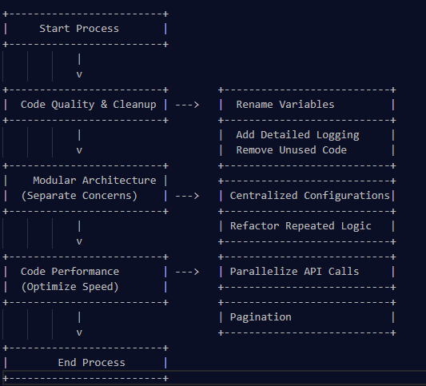

# Key Improvements for Scalability and Performance

## 1. Code Quality and Readability
- **Descriptive Variable Names**: Rename variables to clearly indicate their purpose (e.g., `actionQueue` instead of `q`).
- **Detailed Logging**: Implement logs for critical actions, errors, and performance insights to simplify debugging and monitoring.
- **Remove Unused Code**: Identify and eliminate redundant code or unused variables to streamline the codebase.

## 2. Project Architecture
- **Modularize Code**: Separate API handling, data processing, and error management into distinct modules for better organization and testability.
- **Centralize Configurations**: Move constants (specially common variables like limit, base urls, base configurations and global variables with default values) to a single configuration file for easier management, also it's good to have global dictionary of Contacts and Companies i.e. entities 
- **Use Reusable Helpers**: Refactor repeated logic into helper functions to simplify maintenance and enhance reusability.

## 3. Code Performance
- **Parallelize API Calls**: Optimize performance by executing independent tasks simultaneously.
- **Pagination Logic**: Properly manage pagination to avoid redundant API calls and handle data in chunks efficiently.

=*=*=*=*=*=*=*=*=*=*=*=*=*=*=*=*=*=*=*=*=*=*=*=*=*=*=*=*=*=*=*=*=*=*=*
=*=*=*=*=*=*=*=*=*=*=*=*=*=*=*=*=*=*=*=*=*=*=*=*=*=*=*=*=*=*=*=*=*=*=*

